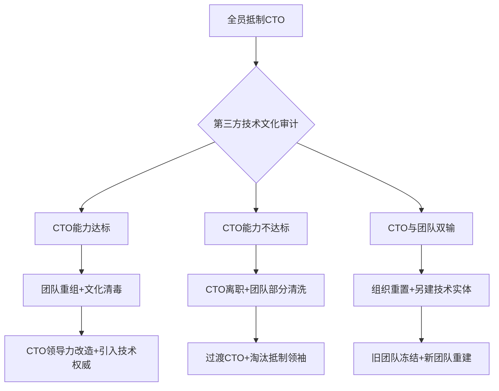

当技术团队已形成系统性抵制CTO的“吐槽文化”，CEO面临的是**组织文化危机与技术领导力崩溃的双重挑战**。此时需采取果断、系统且分阶段的干预策略，避免技术团队瘫痪或集体流失。以下是具体行动框架：

---

### **一、紧急止血：冻结冲突，防止事态恶化**
1. **暂停公开对抗场景：**  
   - 立即叫停所有针对CTO的公开争议会议，避免双方在情绪化状态下进一步撕裂。
   - 要求团队暂缓执行争议性技术决策（除非影响核心业务），为调查争取时间。

2. **隔离冲突双方：**  
   - 授权CTO暂时不参与日常技术管理，避免直接冲突升级（可让其专注技术战略规划等离线工作）。
   - 指定临时技术决策小组（如资深架构师+产品负责人），维持业务运转。

3. **法律风险预警：**  
   - 要求法务介入，明确提醒团队：**有组织的诋毁、消极抵制可能构成违纪甚至违约**，留存邮件/聊天记录等证据。

---

### **二、深度诊断：引入第三方“组织医生”**
> **关键原则：CEO不再依赖内部主观反馈，必须借助完全中立的外部力量。**

1. **聘请技术文化审计机构：**  
   - 选择具备**技术团队评估经验**的组织发展（OD）顾问或技术管理咨询公司。
   - **审计重点**：  
     - 技术决策流程是否科学？争议案例的真实细节（如某次架构升级的论证记录）  
     - CTO的技术能力盲区（通过代码/设计评审回溯、技术方案答辩评估）  
     - 团队抵制动因：技术认知落差？管理风格冲突？利益团体维护？文化排异？  
     - 团队能力基线：是否存在群体性技术滞后？（如全栈能力薄弱抗拒云原生转型）

2. **“背靠背”全员深度访谈：**  
   - 第三方顾问需1对1访谈**所有技术成员+跨部门协作方**，承诺保密性。  
   - **核心问题**：  
     *“如果明天CTO离职，你认为技术方向会更好还是更差？具体原因？”*  
     *“请列举一个CTO技术决策失误的具体证据，以及你当时提出的替代方案”*  
     *“你理想中的技术领导者应具备哪三点能力？当前CTO符合哪些？”*

3. **技术能力穿透测试：**  
   - 顾问组织**闭门技术答辩**：  
     - 要求CTO就公司核心技术栈、系统瓶颈、未来规划进行2小时深度答辩，由外部技术专家质询。  
     - 抽选3-5名抵制派核心成员，就其所负责模块进行架构设计答辩，评估其专业度。  
   > **目的**：客观验证“CTO是否真无能” vs “团队是否在技术层面有资格质疑”。

---

### **三、CEO的终极决策：基于数据的组织手术**
根据第三方报告，CEO需在三种路径中果断选择：

#### **路径1：CTO留任（团队需重构）**  
**适用条件**：审计证明CTO技术能力达标，抵制源于文化冲突或团队能力滞后。  
- **行动方案**：  
  - **公开第三方结论**：清晰展示CTO技术能力评估数据、团队能力短板证据。  
  - **重组技术团队**：  
    - 将抵制领袖（能力尚可者）调离核心岗位或给予离职补偿清退。  
    - 紧急引入2-3名技术权威（如首席架构师）稀释旧势力，注入新文化基因。  
  - **CTO改造计划**：  
    - 强制其参与高管领导力培训，每周与工程师结对工作1天以重建信任。  
    - 剥夺其人事管理权，增设技术运营总监（Technical Operations Director）负责日常执行。  

#### **路径2：CTO离职（团队需清洗）**  
**适用条件**：审计证实CTO技术判断力不匹配岗位，且团队抵制存在合理成分。  
- **行动方案**：  
  - **快速切割CTO**：给予体面离职补偿，签署保密协议。  
  - **根除“吐槽文化”**：  
    - **不进行全员挽留**：公开宣布“文化重置”，鼓励不适应者主动离职（N+1补偿）。  
    - **重点淘汰抵制领袖**：即使技术能力尚可，其破坏性行为不可容忍。  
  - **空降过渡性技术领袖**：  
    - 聘请具有技术威望的临时CTO（如退休技术高管），任务：  
      ① 评估剩余成员真实能力；  
      ② 重建技术流程规范；  
      ③ 物色长期CTO人选。  

#### **路径3：组织重置（核选项）**  
**适用条件**：审计显示**CTO与团队均不合格**（如技术决策混乱+团队能力低下）。  
- **行动方案**：  
  - **暂停现有技术团队职能**：将核心系统移交外包团队或CTO直管的极小可信小组维护。  
  - **成立新技术实体**：  
    - 在异地或独立办公区组建全新技术团队，由CEO直管招募。  
    - 旧团队人员需重新面试入职，淘汰率>70%。  
  - **出售/关停非核心业务线**：集中资源确保主干业务技术重构。  

---

### **四、文化修复：打破恶性循环的长期机制**
无论选择哪条路径，CEO必须重建技术组织健康度：
1. **透明化技术权责：**  
   - 发布《技术决策章程》：明确CTO、架构委员会、工程师的决策边界与申诉流程。  
2. **建立反馈防火墙：**  
   - 推行“反对权”（Right to Challenge）制度：任何技术质疑需附带**替代方案+数据验证**，禁止空泛批评。  
3. **技术能力基线认证：**  
   - 全员年度技术能力评估（第三方出题），未达标者强制培训或调岗。  
4. **CEO-工程师直通管道：**  
   - 每月举办“Coffee with CEO”开放日，但规则：**只讨论建设性提案，禁止抱怨他人**。  

> **警示**：若CEO因短期业务压力向抵制团队妥协，将传递“会哭的孩子有奶吃”的信号，导致组织陷入永久性派系斗争。技术团队的信任一旦崩塌，重建成本远高于换血成本。

---

### **关键决策树**

**最终准则**：技术团队的核心价值是**用专业能力解决问题**，而非**用政治手段解决领导**。CEO的终极责任是让组织回归这一原点，必要时需有“破釜沉舟”的决断力。

